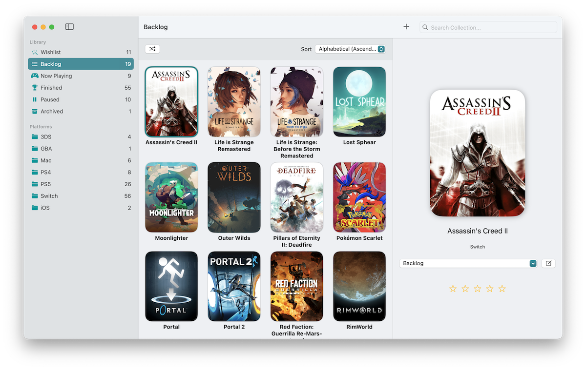

# QuestLogger


[](https://ko-fi.com/T6T66ELM7)

A macOS application for managing you video game collection. Written in SwiftUI, and uses [IGDB](https://api-docs.igdb.com/#getting-started) as a data source.



## Table of Contents
- [Installation](#Installation)
- [Setting Up](#Setting-Up)
- [Compile From Source](#Compile-From-Source)
	- [Prerequisites](#Prerequisites)
	- [Instructions](#Instructions)
- [Library Format](#Library-Format)
- [QuestKit](#QuestKit)
- [Package Dependencies](#Package-Dependencies)
- [License](#License)

## Installation

### Requirements

- An Intel or Apple Silicon Mac running MacOS 13 Ventura or later

### Homebrew

The suggested method for installing QuestLogger is through [Homebrew](https://brew.sh).

1. Add the 'ghall89/tap' tap with `brew tap ghall89/tap` 
2. Install QuestLogger with `brew install --cask questlogger`

Alternatively, you can [manually download](https://github.com/ghall89/questlogger-mac/releases) the latest release of QuestLogger.

## Setting Up

Follow the instructions [here](https://api-docs.igdb.com/#account-creation) if you don't already have a Twitch developer account.

In order to fully utilize the app's features, you will need to enter your Twitch client ID and client secret by going to `QuestLogger → Settings...` in the app's menu bar, or with the following keyboard shortcut: `⌘ + ,`.

## Compile From Source

### Prerequisites

- MacOS 13+
- Xcode 14.3+
- An [Apple Developer Account](https://developer.apple.com)

### Instructions

1. Clone this repo with `git clone git@github.com:ghall89/questlogger-mac.git`
2. Open `QuestLogger.xcodeproj` from the project directory
3. Wait for package dependencies to download
4. From the menubar, go to `Product → Archive`
5. When archive is complete, click `Distribute App` and select either `Direct Distribution` or `Custom` and follow the prompts

## Library Format

The QuestLogger library format is a package containing a JSON file to store the data for the user's game library, as well as an `img` directory with related PNG graphics:

```
📄 Library.quest
├ 📄 game_collection.json
└ 📁 img
  ├ 📄 co1qve.png
  ├ 📄 co4ocq.png
  └ 📄 co5vmg.png
```

By default, the file is stored in the `Documents` directory of QuestLogger's sandbox container, located in `~/Library/Containers/QuestLogger/`.

## QuestKit

QuestKit is a Swift Package that handles QuestLoggers data structures, as well as any related functions, including API calls and managing the `Library.quest` file. You can find out more in the [readme](./QuestKit/README.md).

## Package Dependencies

- [Alamofire](https://github.com/Alamofire/Alamofire)
- [MarkdownUI](https://github.com/gonzalezreal/swift-markdown-ui)
- [SwiftUI CachedAsyncImage](https://github.com/lorenzofiamingo/swiftui-cached-async-image)
- [ReleaseNotificationKit](https://github.com/ghall89/ReleaseNotificationKit)

## License

MIT License

Copyright (c) 2023 Graham Hall

Permission is hereby granted, free of charge, to any person obtaining a copy
of this software and associated documentation files (the "Software"), to deal
in the Software without restriction, including without limitation the rights
to use, copy, modify, merge, publish, distribute, sublicense, and/or sell
copies of the Software, and to permit persons to whom the Software is
furnished to do so, subject to the following conditions:

The above copyright notice and this permission notice shall be included in all
copies or substantial portions of the Software.

THE SOFTWARE IS PROVIDED "AS IS", WITHOUT WARRANTY OF ANY KIND, EXPRESS OR
IMPLIED, INCLUDING BUT NOT LIMITED TO THE WARRANTIES OF MERCHANTABILITY,
FITNESS FOR A PARTICULAR PURPOSE AND NONINFRINGEMENT. IN NO EVENT SHALL THE
AUTHORS OR COPYRIGHT HOLDERS BE LIABLE FOR ANY CLAIM, DAMAGES OR OTHER
LIABILITY, WHETHER IN AN ACTION OF CONTRACT, TORT OR OTHERWISE, ARISING FROM,
OUT OF OR IN CONNECTION WITH THE SOFTWARE OR THE USE OR OTHER DEALINGS IN THE
SOFTWARE.
